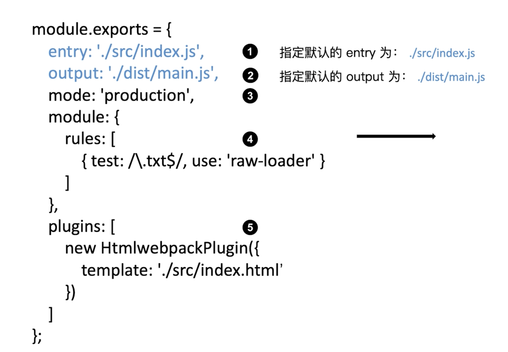
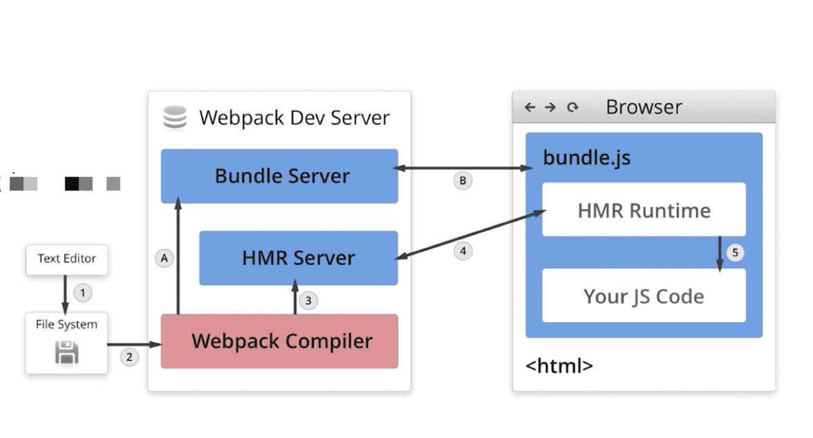
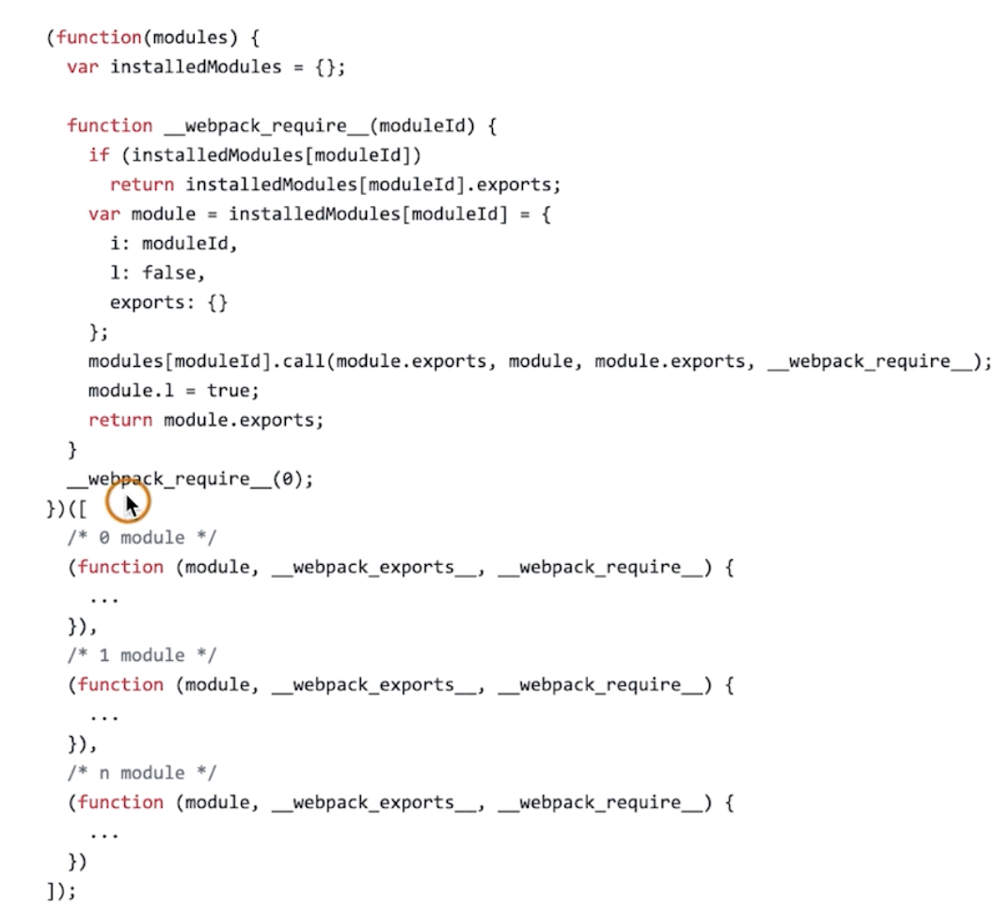
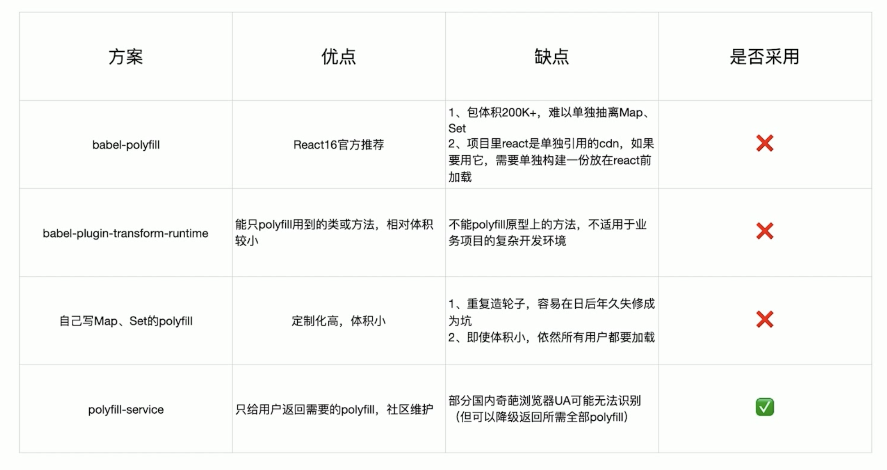

# webpack学习目录

* [构建工具](#构建工具)
   * [为什么需要构建工具？](#为什么需要构建工具)
   * [前端构建工具的演变历史](#前端构建工具的演变历史)
   * [为什么选择 webpack ?](#为什么选择-webpack-)
* [初识 webpack](#初识-webpack)
   * [配置文件](#配置文件)
   * [Loaders](#loaders)
      * [常见的 Loaders](#常见的-loaders)
      * [Loaders 的用法](#loaders-的用法)
   * [Plugins](#plugins)
      * [常见的 Plugins](#常见的-plugins)
      * [Plugins 的使用](#plugins-的使用)
   * [Mode](#mode)
* [webpack 使用](#webpack-使用)
  * [练习使用](#练习使用)
  * [webpack 中文件监听](#webpack-中文件监听)
  * [热更新 webpack-dev-server](#热更新-webpack-dev-server)
  * [热更新 webpack-dev-middleware](#热更新-webpack-dev-middleware)
  * [热更新的原理分析](#热更新的原理分析)
   * [文件指纹策略](#文件指纹策略)
      * [文件指纹的生成方式](#文件指纹的生成方式)
      * [文件指纹 webpack 配置](#文件指纹-webpack-配置)
   * [代码压缩](#代码压缩)
      * [JS 文件压缩](#js-文件压缩)
      * [CSS 文件压缩](#css-文件压缩)
      * [html 文件压缩](#html-文件压缩)
* [webpack 进阶](#webpack-进阶)
   * [PostCSS 插件 autoprefixer 自动补齐 CSS3 前缀](#postcss-插件-autoprefixer-自动补齐-css3-前缀)
   * [移动端 CSS px 自动转成 rem](#移动端-css-px-自动转成-rem)
   * [静态资源的内联](#静态资源的内联)
      * [资源内联的意义](#资源内联的意义)
         * [代码层面：](#代码层面)
         * [请求层面：减少 HTTP 网络请求数](#请求层面减少-http-网络请求数)
      * [HTML 和 JS 内联](#html-和-js-内联)
      * [CSS 内联](#css-内联)
   * [多页面应用（MPA）打包通用方案](#多页面应用mpa打包通用方案)
   * [source map](#source-map)
   * [Tree-shaking](#tree-shaking)
      * [DCE (Elimination)](#dce-elimination)
      * [Tree-shaking 的原理](#tree-shaking-的原理)
   * [ScopeHoisting 的使用和原理分析](#scopehoisting-的使用和原理分析)
      * [scope hoisting 原理](#scope-hoisting-原理)
      * [使用](#使用)
   * [体积优化策略](#体积优化策略)
      * [公共资源分离](#公共资源分离)
      * [图片压缩](#图片压缩)
      * [imagemin 的优点](#imagemin-的优点)
      * [imagemin 的压缩原理](#imagemin-的压缩原理)
      * [动态 Polyfill](#动态-polyfill)
   * [分割代码和动态 import](#分割代码和动态-import)
* [webpack 性能分析和优化](#webpack-性能分析和优化)
   * [初级分析：使用 webpack 内置的 stats](#初级分析使用-webpack-内置的-stats)
   * [速度分析：使用 speed-measure-webpack-plugin](#速度分析使用-speed-measure-webpack-plugin)
   * [体积分析：使用 webpack-bundle-analyszer](#体积分析使用-webpack-bundle-analyszer)
   * [多进程/多实例构建](#多进程多实例构建)
   * [多进程/多实例并行压缩](#多进程多实例并行压缩)
   * [进一步分包：预编译资源模块](#进一步分包预编译资源模块)
      * [分包：设置 Externals](#分包设置-externals)
      * [进一步分包：预编译资源模块](#进一步分包预编译资源模块-1)
   * [充分利用缓存提升二次构建速度](#充分利用缓存提升二次构建速度)
   * [缩小构建目标](#缩小构建目标)
      * [减少文件搜索范围](#减少文件搜索范围)

## 构建工具

### 为什么需要构建工具？

- 转换 ES6/ES7 、TypeScript 语法
- 转换 JSX （Angular、React、Vue 模板语法）
- CSS 前缀补全/预处理器
- 压缩混淆
- 图片压缩

## 初识 webpack

### 配置文件

基本的包括 entry、output、mode、module、plugins 几种



- 当 entry 为多入口时，output 可以通过**占位符**的方式支持多文件名称的区分

```js
const path = require('path');
module.exports = {
  entry: {
    index: './src/index.js',
    search: './src/search.js',
  },
  output: {
    path: path.join(__dirname, 'dist'),
    filename: '[name].bundle.js',
  },
  mode: 'production',
};
```

### Loaders

Loaders 是 webpack 的核心概念。webpack 开箱即用只支持 JS 和 JSON 两种文件类型，通过 Loaders 去支持其它文件类型并且把它们转化成有效的模块，并且可以添加到依赖图中。

Loaders 本身是一个函数，接受源文件作为参数，返回转换的结果。

#### 常见的 Loaders

列举部分，更多见 [loaders](https://webpack.js.org/loaders/)

- `babel-loader` 转换 ES6\ES7 等 JS 新特性语法
- `css-loader` 支持.css 文件的加载和解析
- `less-loader` 将 less 文件转换成 css
- `ts-loader` 将 TS 转换成 JS
- `file-loader` 进行图片、文字等的打包
- `raw-loader` 将文件以字符串的形式导入
- `thread-loader` 多进程打包 JS 和 CSS

#### Loaders 的用法

```js
module: {
  rules: [
    // test 指定匹配规则，use 指定使用的 loader 名称
    { test: /\.txt$/, use: 'raw-loader' },
  ];
}
```

### Plugins

`Plugins` 用于 `bundle` 文件的优化，资源管理和环境变量注入，作用域整个构建过程。

#### 常见的 Plugins

_列举部分_，更多见 [plugins](https://webpack.js.org/plugins/)

- `CommonsChunkPlugin` 将 chunks 相同的模块代码提取成公共 js
- `CleanWebpackPlugin` 清理构建目录
- `ExtractTextWebpackPlugin` 将 CSS 从 bundle 文件中提取成一个独立的 CSS 文件
- `CopyWebpackPlugin` 将文件或者文件夹拷贝到构建的输出目录
- `HTMLWebpackPlugin` 创建 html 文件去承输出的 bundle
- `UglifyjsWebpackPlugin` 压缩 JS
- `ZipWebpackPlugin` 将打包出的资源生成一个 zip 包

#### Plugins 的使用

在配置文件中的 plugins 数组里将定义好的插件放入即可。

### Mode

Mode 用来指定当前的构建环境是: `production` 、`development` 还是 `none` , 对应 node.js 中的 `process.env.NODE_ENV`。

设置 mode 可以使用 webpack 内置的函数，默认设置为 `production`

详细见：https://webpack.js.org/configuration/mode/

## webpack 使用

#### 练习使用

- 解析 ES6 和 React JSX
- 解析 CSS、Less 和 Sass
- 解析图片和字体、小图片直接 base64 打包

#### webpack 中文件监听

1、 `--watch` 监听文件改动，构建命令改为 `webpack --watch`

缺点：构建后需要手动刷新浏览器页面才能看到效果

2、文件监听的原理分析

轮询判断文件的最后编辑时间是否变化，某个文件发生了变化，并不会立刻告诉监听者，而是先缓存起来，等 aggregateTimeout

```js
module.exports = {
  // 默认 false， 也就是不开启
  watch: true,
  watchOptions: {
    // 默认为空，不监听的文件或者文件夹，支持正则匹配
    ignored: /node_modules/,
    // 监听到变化发生后等300ms再去执行，默认 300ms
    aggregateTimeout: 300,
    // 判断文件是否发生变化是通过不停的询问系统指定文件有没有变化实现的，默认每秒问1000次
    poll: 1000,
  },
};
```

#### 热更新 webpack-dev-server

- WDS 不刷新浏览器
- WDS 不输出文件（非 IO），而是放在内存中，速度有优势
- 使用 `HotModuleReplacementPlugin` 插件配合

```js
// webpack.config.js 主要内容
plugins: [new webpack.HotModuleReplacementPlugin()],
devServer: {
    contentBase: './dist',
    hot: true,
 }
// package.json script 脚本的配置
"dev": "webpack-dev-server --open"
```

#### 热更新 webpack-dev-middleware

- WDM 将 webpack 输出的文件传给服务器
- 适用于灵活的定制场景

```js
const express = require('express');
const webpack = require('webpack');
const webpackDevMiddleware = require('webpack-dev-middleware');

const app = express();
const config = require('./webpack.config.js');
const compiler = webpack(config);

app.use(
  webpackDevMiddleware(compiler, {
    publicPath: config.output.publicPath,
  })
);

app.listen(3000, function() {
  console.log('Example app listening on port 3000!\n');
});
```

#### 热更新的原理分析

- Webpack Compile：将 JS 编译成 Bundle
- HMR Server：将热更新文件输出给 HMR Rumtime
- Bundle server: 提供文件在浏览器的访问
- HMR Runtime：会被注入到浏览器，更新文件的变化 （websocket 建立连接）
- bundle.js： 构建输出的文件



**概述过程：**

- （启动阶段 1、2、A、B）源代码文件经过 Webpack Compiler 编译后，生成 bundle，然后 Bundle Server 提供 bundle 文件在浏览器中访问；

- （热更新阶段 1、2、3、4）文件变化后，还是经过 Webpack Complier 进行编译，然后将变化的代码传给 HMR Server，HMR Server（服务端） 和 HMR Runtime（客户端） 一直通信，当有代码更新（通知过了 HMR Runtime 后），HMR Server 会将更新的代码模块以 JSON 的形式发送给 HMR Runtime，然后 HMR Runtime 进行一个代码的更新，而不需要刷新浏览器页面。

### 文件指纹策略

#### 文件指纹的生成方式

- **Hash** : 和整个项目的构建相关，只要项目文件有修改，整个项目构建的 hash 值就会更改
- **Chunkhash** ：和 webpack 打包的 chunk 有关，不同的 entry 会生成不同的 chunkhash 值
- **Contenthash**：根据文件内容来定义 hash，文件内容不变，则 contenthash 不变

#### 文件指纹 webpack 配置

css 文件一般用 contenthash 来实现，js 则使用 chunkhash, 图片资源用 hash。相关配置和输出结果如下：

```js
'use strict';
const path = require('path');
const MiniCssExtractPlugin = require('mini-css-extract-plugin'); // 提取css 为文件（和 style-loader互斥）

module.exports = {
  entry: {
    index: './src/index.js',
    search: './src/search.js',
  },
  output: {
    path: path.join(__dirname, 'dist'),
    filename: '[name]_[chunkhash:8].js',
  },
  mode: 'production',
  module: {
    rules: [
      {
        test: /.js$/,
        use: 'babel-loader',
      },
      {
        test: /.css$/,
        use: [MiniCssExtractPlugin.loader, 'css-loader'],
      },
      {
        test: /.less$/,
        use: [MiniCssExtractPlugin.loader, 'css-loader', 'less-loader'],
      },
      {
        test: /.png|.jpg|.jpeg|.gif$/, // /.(png|jpg|gif|jpeg)$/
        use: [
          {
            loader: 'file-loader',
            options: {
              name: '[name]_[hash:8][ext]',
            },
          },
        ],
      },
    ],
  },
  plugins: [
    new MiniCssExtractPlugin({
      filename: '[name]_[contenthash:8].css',
    }),
  ],
};
```

```shell
Built at: 03/25/2020 6:30:13 PM
              Asset      Size  Chunks                                Chunk Names
  index_443df551.js  1.01 KiB       0  [emitted] [immutable]         index
 search_650a0e60.js   129 KiB       1  [emitted] [immutable]         search
search_6dd0097b.css  57 bytes       1  [emitted] [immutable]         search
webpack_365b2ee8png   253 KiB          [emitted]              [big]
```

### 代码压缩

#### JS 文件压缩

内置插件 `uglifyjs-webpack-plugin`

#### CSS 文件压缩

使用 `optimize-css-assets-webpack-plugin`，同时使用 `cssnano` 预处理器处理 CSS

```js
plugins: [
  new OptimizeCSSAssetsPlugin({
    assetNameRegExp: /\.css$/g,
    cssProcessor: require('cssnano'),
  }),
];
```

#### html 文件压缩

修改 `htm-webpack-plugin`，设置压缩参数

```js
plugins: [
  new HtmlWebpackPlugin({
    template: path.join(__dirname, 'src/search.html'),
    filename: 'search.html',
    chunks: ['search'],
    inject: true,
    minify: {
      html5: true,
      collapseWhitespace: true,
      preserveLineBreaks: false,
      minifyCSS: true,
      minifyJS: true,
      removeComments: false,
    },
  }),
];
```

## webpack 进阶

### PostCSS 插件 autoprefixer 自动补齐 CSS3 前缀

浏览器内核和对应 CSS3 属性前缀：

- Trident(-ms)
- Geko(-moz)
- Webkit(-webkit)
- Presto(-o)

使用 `autoprefixer` 插件（配合 prostcss-loader 使用），根据 Can I Use 规则 （https://caniuse.com)

```js
 {
        test: /.less$/,
        use: [
          MiniCssExtractPlugin.loader,
          'css-loader',
          'less-loader',
          { // +++ 新增内容
            loader: 'postcss-loader',
            options: {
              plugins: () => [
                require('autoprefixer')({
                  // 浏览器支持的最新的两个版本、使用人数>1%、IOS 版本兼容到8
                  overrideBrowserslist: ['last 2 version', '>1%', 'ios 8'],
                })
              ]
            },
          },
        ],
      },
```

### 移动端 CSS px 自动转成 rem

- 使用 `px2rem-loader`
- 页面渲染时计算根元素的 `font-size` 值

  - 可以使用手淘的 `lib-flexible` 库
  - https://github.com/amfe/lib-flexible

- viewpoint 得到更多的浏览器支持后，可以使用 viewpoint 代替 lib-flexible , px 到 vw 的转换插件

```js
module.exports = {
  module: {
    rules: [
      {
        test: /\.less$/,
        use: [
          'style-loader',
          'css-loader',
          'less-loader',
          {
            // +++
            loader: 'px2rem-loader',
            options: {
              remUnit: 75, // 1rem 代表多少 px
              remPrecision: 8, // 小数点保留位数
            },
          },
        ],
      },
    ],
  },
};
```

还需要将 `lib-flexible` 内联到 html head 头部，为了页面渲染的时候提早计算到根元素的 font-size 的大小。

### 静态资源的内联

#### 资源内联的意义

##### 代码层面：

- 页面框架的初始化脚本
- 上报相关打点
- css 内联避免页面闪动

##### 请求层面：减少 HTTP 网络请求数

- 小图片或者字体内联 (url-loader)

#### HTML 和 JS 内联

`raw-loader` 内联 html

```html
${require('raw-loader!babel-loader!./meta.html')}
```

`raw-loader` 内联 JS

```html
<script>
  ${require('raw-loader!babel-loader!./node_modules/lib-flexible/flexible.js')}
</script>
```

#### CSS 内联

- 方案一：借助 style-loader
- 方案二：html-inline-css-webpack-plugin

### 多页面应用（MPA）打包通用方案

基本实现思路：每个页面对应一个 entry，一个 html-webpack-plugin。缺点：每次新增或删除页面都需要改 webpack 配置。

解决方案：动态获取 entry 和设置 html-webpack-plugin 数量，利用 `glob.sync`

```js
entry: glob.sync(path.join(__dirname,'./src/*/index.js')),
```

### source map

**source map 类型关键词：**

- eval: 使用 eval 包裹模块代码
- source map: 产生 .map 文件
- cheap: 不包含列信息
- inline: 将 .map 作为 DataURI 嵌入，不单独生产 .map 文件
- module: 包含 loader 的 sourcemap

### Tree-shaking

#### DCE (Elimination)

tree-shaking 利用了 DCE 的特点做优化：

- 代码不会被执行，不可到达，比如 `if(false){// 这里边的代码}`
- 代码执行的结果不会被用到
- 代码只会影响死变量（只写不读）想
- 方法不能有副作用

#### Tree-shaking 的原理

- 利用 ES6 模块的特点：
  - 只能作为模块顶层的语句出现
  - import 的模块名只能是字符串常量
  - import binding 是 immutable 的
- 代码擦除：uglify 阶段删除无用代码

### ScopeHoisting 的使用和原理分析

> https://segmentfault.com/a/1190000012600832

**1、现象：webpack 构建后的带存在大量的闭包代码**

eg:

假如现在有两个文件分别是 util.js:

```js
export default 'Hello,Webpack';
```

和入口文件 main.js:

```js
import str from './util.js';
console.log(str);
```

以上源码用 Webpack 打包后输出中的部分代码如下：

```js
// 模块初始化函数，为了兼容各种浏览器
[
  function(module, __webpack_exports__, __webpack_require__) {
    var __WEBPACK_IMPORTED_MODULE_0__util_js__ = __webpack_require__(1);
    console.log(__WEBPACK_IMPORTED_MODULE_0__util_js__['a']);
  },
  function(module, __webpack_exports__, __webpack_require__) {
    __webpack_exports__['a'] = 'Hello,Webpack';
  },
];
```

**2、会导致什么问题？**

- 大量函数闭包包裹代码，导致体积增大（模块越多越明显）
- 运行代码时创建的函数作用域变多，内存开销变大

**3、结论**

- 被 webpack 转换后的模块会加上一层包裹
- `import` 会被转换成 `__webpack_require`

**4、进一步分析 webpack 的模块机制**

分析：

- 打包出来的是一个 IIFE (匿名闭包)
- modules 是一个数组，每一项是一个模块初始化函数
- \_\_webpack_require 用来加载模块，返回 module.exports
- 通过 WEBPACK_REQUIRE_METHOD(0) 启动程序



#### scope hoisting 原理

原理：将所有的模块的代码按照引用顺序放到一个函数作用域里，然后适当的重命名一些变量以防止变量名冲突
对比：通过 scope hoisting 可以减少函数声明代码和内存开销

```js
// 在开启 Scope Hoisting 后，同样的源码输出的部分代码如下
[
  function(module, __webpack_exports__, __webpack_require__) {
    var util = 'Hello,Webpack';
    console.log(util);
  },
];
```

#### 使用

webpack v4 在将 mode 设置为 `production` 会默认开启 scope hoisting ，且必须是 ES6 语法，CJS 不支持（这点和 tree-shaking 一样）。

### 体积优化策略

- Tree-shaking
- ScopeHoisting
- 公共资源分离
- 图片压缩
- 动态 Polyfill

下边介绍后边三者

#### 公共资源分离

#### 图片压缩

要求：基于 Node 库的 **imagemin** 或者 tinypng API

使用：配置 [image-webpack-loader](https://www.npmjs.com/package/image-webpack-loader)

#### imagemin 的优点

- 有很多定制选项
- 可以引入更多第三方优化插件，列如 pngquant
- 支持处理多种图片格式

#### imagemin 的压缩原理

- pngquant：是一款 PNG 压缩器，通过图像转换为具有 alpha 通道（通常比 24/32 位 PNG 文件小 60%-80%）的更高效的 8 位 PNG 格式，可显著减小文件大小。
- pngcrush: 其主要目的是通过尝试不同的压缩级别和 PNG 过滤方法来降低 PNG IDAT 数据流的大小。
- optipng：其设计灵感来源于 pngcrush. optipng 可将图像文件重新压缩为更小的尺寸，而不会丢失任何信息。
- tinypng： 也是将 24 位 png 文件转化为更小有索引的 8 位图片，同时所有非必要的 metadata 也会被剥离掉。

#### 动态 Polyfill

背景：babel-polyfill 打包后体积 88.49k。

构建体积优化：动态 Polyfill。如 polyfill.io

**polyfill service 原理**：识别 User Agent，下发不同的 Polyfill，不加载多余的已支持的特性



### 分割代码和动态 import

## webpack 性能分析和优化

### 初级分析：使用 webpack 内置的 stats

### 速度分析：使用 speed-measure-webpack-plugin

### 体积分析：使用 webpack-bundle-analyszer

### 多进程/多实例构建

- thread-loader (官方)
- HappyPack
- parallet-webpack

### 多进程/多实例并行压缩

推荐使用 `terser-webpack-plugin`，设置参数 parallel

### 进一步分包：预编译资源模块

#### 分包：设置 Externals

思路：将 react、react-dom 基础包通过 cdn 引入，不大于 bundle 中

方法：使用 `html-webpack-externals-plugin`

问题：业务包多的时候，这种方式会在页面中引入很多 script 标签

#### 进一步分包：预编译资源模块

思路：将 react、react-dom、redux、react-redux 基础包和业务基础包打包成一个文件

方法：使用 `DLLPlugin` 进行分包，`DllReferencePlugin` 对 `manifest.json` 引用

```js
// webpack.dll.js
const webpack = require('webpack');
module.exports = {
  context: process.cwd(),
  // resolve: {
  //   extensions: ['.js', ''],
  // },
  entry: {
    libaray: ['react', 'react-dom'],
  },
  output: {
    filename: '[name]_[chunkhash].dll.js',
    path: path.join(__dirname, 'build/library'),
    library: '[name]',
  },
  plugins: [
    new webpack.DllPlugin({
      name: '[name]_[chunkhash]',
      path: path.join(__dirname, 'build/library/[name].json'),
    }),
  ],
};
```

然后 `webpack.prod.js` 中添加 DllReferencePlugin 插件，指定 manifest json

```js
new webpack.DllReferencePlugin({
  manifest: require('./build/library/library.json'),
});
```

### 充分利用缓存提升二次构建速度

缓存思路：

- babel-loader 开启缓存（后边加 `?cacheDirectory=true`)
- terser-webpack-plugin 开启缓存 （属性 `cache:true`）
- 使用 cache-loader 或者 hard-source-webpack-plugin

### 缩小构建目标

目的：尽可能的少构建模块，比如 `babel-loader` 不解析 `node_module`。

#### 减少文件搜索范围

- 优化 resolve.modules 配置（减少模块搜索层级）
- 优化 resolve.mainFields 配置
- 优化 resolve.extensions 配置
- 合理使用 alias
